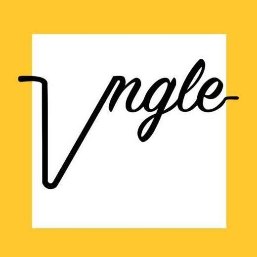

 

  

<h1 align="center">
  Vngle ("various angles")
</h1>
A decentralized grassroots news network for news deserts.

# Problem

There are 3,143 counties in the U.S. & before the pandemic over 2,000 of them had limited to no access to daily local news. COVID-19 layoffs have exacerbated that, leaving an even larger sum of Americans without essential real-time relevant information. The Brookings Institute reports that nearly 57% of U.S. counties that have reported cases of COVID-19, lack a daily local news source. Now more than ever, cities need a central place to access credible, real-time local information, including diverse perspectives on how communities are effectively handling the pandemic.

# What We Do

Vngle seeks to proactively inform isolated communities through a decentralized grassroots news network, taking a gig-economy approach to sourcing stories and experiences by organizing trained and vetted community members to capture underreported information.

The website allows new visitors to subscribe to newsletters based on their location (city or zip code). The main section showcases captured community experiences shared by locals across the United States (via our Instagram feed). The website also empowers visitors wishing to take part in the newsgathering process by facilitating the ability to request local coverage on matters unknown or not being represented to the general public, as well as the option to upload their own grassroots stories and content (e.g. photos, videos, etc).
